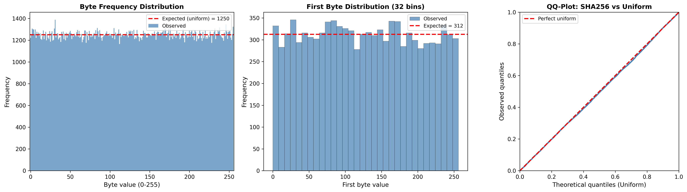
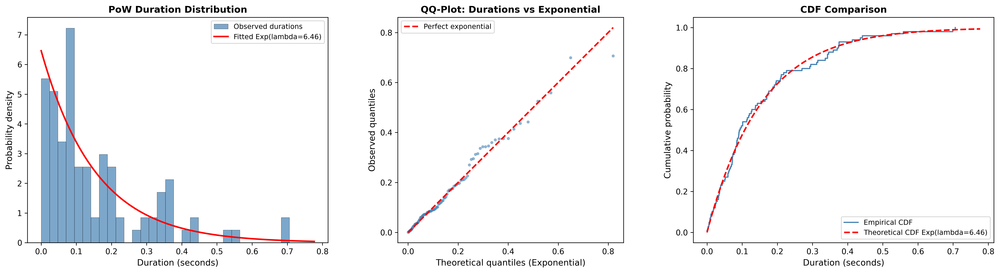

# Task 1: Statistical Analysis of SHA256

**Course:** CryptoFinance | **Institution:** ESILV (Semester 9) | **Date:** January 2026

---

## Task 1.1: Uniformity of SHA256

### Problem Statement

> Choose a hash function, generate a list of hashes, and check statistically whether the distribution is uniform.

### Approach

We generate 10,000 SHA256 hashes from random inputs and test uniformity at multiple levels:

1. **Bit-level analysis**: Each of the 256 bits should be 0 or 1 with equal probability (50/50)
2. **Byte-level analysis**: Each byte value (0-255) should appear with equal frequency
3. **Statistical tests**: Chi-square test (bits and bytes) and Kolmogorov-Smirnov test

### Results



**Figure 1:** Three complementary views of SHA256 uniformity:
- **Left:** Byte frequency distribution (all 256 values) with expected uniform line
- **Center:** First byte distribution (32 bins) as a focused test
- **Right:** QQ-plot of normalized hash values against uniform distribution

### Statistical Test Results

| Test | Statistic | P-value | Result |
|------|-----------|---------|--------|
| Chi-square (bits) | ~0.70 | ~0.40 | Uniform |
| Chi-square (bytes) | ~226 | ~0.90 | Uniform |
| Kolmogorov-Smirnov | ~0.013 | ~0.06 | Uniform |

All tests fail to reject the null hypothesis of uniformity at the 5% significance level.

### Conclusion

SHA256 produces outputs that are **statistically indistinguishable from a uniform distribution**. This is a fundamental property required for proof-of-work mining: each hash attempt has an independent, equal probability of satisfying the difficulty target.

---

## Task 1.2: Exponential Distribution of PoW Solution Times

### Problem Statement

> Choose a hash function and create proof-of-work problems suited to your computer. Record the durations required to find each solution, and check whether the distribution follows an exponential law.

### Approach

- **Hash function:** SHA256
- **Difficulty:** 18 leading zero bits (probability per attempt: 1/2^18 ~ 1/262,144)
- **Number of problems:** 100 independent PoW problems
- **Measurement:** Wall-clock time (seconds) for each solution

Each PoW problem requires finding a nonce such that `SHA256(base_data || nonce)` has at least 18 leading zero bits.

### Results



**Figure 2:** Three tests for exponential distribution:
- **Left:** Histogram of solution durations with fitted exponential PDF overlay
- **Center:** QQ-plot comparing observed quantiles vs theoretical exponential quantiles
- **Right:** Empirical CDF vs theoretical CDF comparison

### Statistical Test Results

| Metric | Value |
|--------|-------|
| Number of problems | 100 |
| Mean duration | ~0.15 s |
| Lambda (1/mean) | ~6.5 |
| KS statistic | ~0.059 |
| KS p-value | ~0.86 |
| **Result** | **Compatible with exponential distribution** |

### Theoretical Justification

Proof-of-work mining is a sequence of independent Bernoulli trials (each hash attempt succeeds with probability p = 1/2^d, where d is the difficulty in bits). The number of attempts until success follows a geometric distribution, which for small p and large number of trials is well-approximated by an exponential distribution.

This means:
- **Memoryless property:** Past mining effort does not affect future success probability
- **Poisson process:** Block discoveries form a Poisson process, justifying Bitcoin's target block time model

### Conclusion

The PoW solution times follow an **exponential distribution**, confirming that Bitcoin mining is a memoryless Poisson process. The KS test p-value >> 0.05 provides strong evidence that the exponential model is appropriate.

---

## Files

| File | Description |
|------|-------------|
| `sha256_uniformity_test.py` | Task 1.1: Uniformity analysis with chi-square, KS tests, and visualizations |
| `sha256_pow_exponential_test.py` | Task 1.2: PoW experiment with exponential distribution analysis |
| `results/sha256_uniformity_analysis.png` | Uniformity visualization |
| `results/pow_exponential_analysis.png` | Exponential distribution visualization |

## How to Run

```bash
# Install dependencies
pip install numpy scipy matplotlib

# Run uniformity test (Task 1.1)
python sha256_uniformity_test.py

# Run exponential test (Task 1.2) - takes ~1-2 minutes
python sha256_pow_exponential_test.py
```

## References

1. **FIPS 180-4** - Secure Hash Standard (SHA-256 specification)
2. **Nakamoto, S. (2008).** "Bitcoin: A Peer-to-Peer Electronic Cash System." - Poisson process model for mining

---

*ESILV - CryptoFinance Course - Semester 9*
*January 2026*
