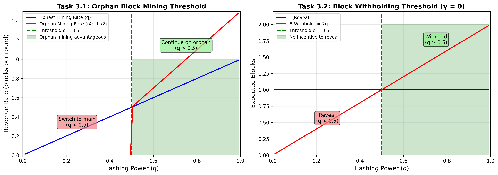
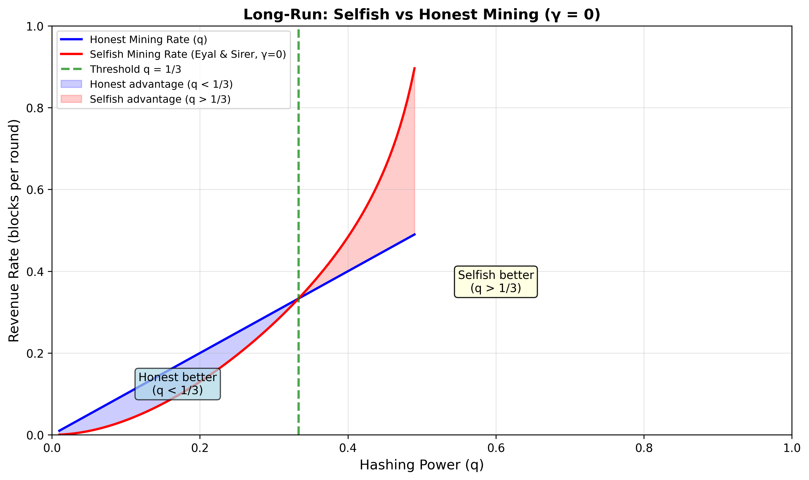

# Bitcoin Mining Thresholds - Analysis Results

**Course:** CryptoFinance | **Institution:** ESILV (Semester 9) | **Date:** January 2026

---

## Executive Summary

This analysis determines critical hash power thresholds for strategic mining decisions in Bitcoin:

| Task | Scenario | Threshold | Interpretation |
|------|----------|-----------|----------------|
| **3.1** | Continue mining on orphan block | **q = 50%** | Majority miners should continue on orphans |
| **3.2** | Withhold newly found block (γ=0) | **q = 50%** | Majority miners have no incentive to reveal |

**Key Finding:** Both thresholds equal 50% - the classic majority threshold in Bitcoin.

---

## Task 3.1: Orphan Block Mining Threshold

### Problem Statement

> Determine the hashing power threshold above which an otherwise honest miner would find it advantageous to mine on an orphan block they produced, despite being one block behind the official blockchain.

### Scenario

- Miner produced a block at height *n* that got **orphaned**
- Network's block at height *n* became the official one
- Main chain extended to height *n+1*
- Miner is now **1 block behind** (state = -1)

**Decision:** Continue mining on the orphan fork or switch to the main chain?

### Mathematical Analysis

#### For q > 0.5 (majority hash power):

The miner will **always eventually catch up** (P(win) = 1).

**Expected time to catch up:**
```
E[T] = 2 / (2q - 1)
```

**Expected credited blocks when winning:**
```
E[credited] = (4q - 1) / (2q - 1)
```
This includes the orphan block plus blocks mined during the catch-up race.

#### Revenue Rate Comparison

**Orphan mining rate:**
```
R_orphan = E[credited] / E[T] = (4q - 1) / 2
```

**Honest mining rate:**
```
R_honest = q
```

#### Threshold Derivation

For orphan mining to be advantageous:
```
R_orphan > R_honest
(4q - 1) / 2 > q
4q - 1 > 2q
2q > 1
q > 0.5
```

### Result



**Threshold: q = 0.5 (50%)**

| Hash Power | Best Strategy | Reasoning |
|------------|---------------|-----------|
| q > 50% | **Continue on orphan** | Will catch up with probability 1, higher rate |
| q < 50% | **Switch to main chain** | Unlikely to catch up, wasting resources |
| q = 50% | Indifferent | Expected values are equal |

### Simulation Verification

| q | Orphan Rate | Honest Rate | Better Strategy |
|---|-------------|-------------|-----------------|
| 0.40 | 0.0006 | 0.4000 | HONEST |
| 0.45 | 0.0026 | 0.4500 | HONEST |
| 0.50 | 0.2653 | 0.5000 | ~EQUAL |
| 0.55 | 0.5979 | 0.5500 | ORPHAN |
| 0.60 | 0.6949 | 0.6000 | ORPHAN |
| 0.70 | 0.9056 | 0.7000 | ORPHAN |

**Simulation confirms the threshold at q = 0.5**

---

## Task 3.2: Block Withholding Threshold (γ = 0)

### Problem Statement

> In the case where a rational miner has no connectivity (γ = 0), determine the threshold in terms of hashing power beyond which this miner has no incentive to reveal a block they have just discovered on top of a block from the official blockchain.

### Scenario

- Miner just discovered a block extending the main chain
- Miner is now at **state +1** (1 block ahead, privately)
- **Connectivity γ = 0** (miner loses ALL races)

**Decision:** Reveal the block immediately or withhold it?

### Mathematical Analysis

At state +1, comparing two options:

#### Option A: Reveal Immediately
```
E[blocks] = 1 (certain)
```

#### Option B: Withhold
- With probability **q**: miner finds next block → publish both → **2 blocks**
- With probability **(1-q)**: network finds block → race → lose (γ=0) → **0 blocks**

```
E[blocks] = q × 2 + (1-q) × 0 = 2q
```

#### Threshold Derivation

For withholding to be at least as good as revealing:
```
E[withhold] ≥ E[reveal]
2q ≥ 1
q ≥ 0.5
```

### Result

**Threshold: q = 0.5 (50%)**

| Hash Power | Best Decision | Reasoning |
|------------|---------------|-----------|
| q ≥ 50% | **No incentive to reveal** | E[withhold] ≥ E[reveal] |
| q < 50% | **Reveal immediately** | E[withhold] < E[reveal] |
| q = 50% | Indifferent | E[withhold] = E[reveal] = 1 |

### Simulation Verification

| q | E[Withhold] | E[Reveal] | Better Option |
|---|-------------|-----------|---------------|
| 0.30 | 0.5970 | 1.0000 | REVEAL |
| 0.40 | 0.7976 | 1.0000 | REVEAL |
| 0.45 | 0.9030 | 1.0000 | REVEAL |
| 0.50 | 0.9959 | 1.0000 | ~EQUAL |
| 0.55 | 1.1003 | 1.0000 | WITHHOLD |
| 0.60 | 1.1988 | 1.0000 | WITHHOLD |

**Simulation confirms the threshold at q = 0.5**

### Important Caveat: Long-Run Analysis

While the one-shot decision at state +1 has threshold q = 0.5, the **full selfish mining strategy** with γ = 0 uses the Eyal & Sirer (2014) formula and has a **lower threshold of q = 1/3**.



**Selfish mining rate (γ = 0, Eyal & Sirer 2014):**
```
R_selfish = [4q²(1-q)² - q³] / [1 - q - 2q² + q³]
```

**Honest mining rate:**
```
R_honest = q
```

**Comparison:**

| q | Selfish Rate | Honest Rate | Difference |
|---|--------------|-------------|------------|
| 0.20 | 0.1297 | 0.2000 | -0.0703 |
| 0.30 | 0.2731 | 0.3000 | -0.0269 |
| 1/3 | 0.3333 | 0.3333 | 0.0000 |
| 0.35 | 0.3665 | 0.3500 | +0.0165 |
| 0.40 | 0.4837 | 0.4000 | +0.0837 |
| 0.45 | 0.6518 | 0.4500 | +0.2018 |

**Conclusion:** The full selfish mining strategy with γ = 0 becomes profitable at **q > 1/3**. This is a lower threshold than the one-shot withholding decision (q = 0.5) because the full strategy exploits states beyond +1 (override at state +2, publish-and-wait at higher states).

---

## Theoretical Background

### Random Walk Model

Both problems can be modeled as **biased random walks**:

- **State s** = (miner's chain length) - (main chain length)
- Each round: state increases by 1 with prob q (miner finds block), decreases by 1 with prob (1-q)

### Key Formulas

**Probability of reaching +1 from state s (for q > 0.5):**
```
P(reach +1 | start at s) = 1 for any s
```

**Expected time to reach +1 from state s:**
```
E[T_s] = (1 - s) / (2q - 1)
```

**Gambler's Ruin Probability (for q < 0.5):**
```
P(reach +1 | start at s) = (q / (1-q))^(1-s)
```

---

## Conclusions

### Task 3.1: Orphan Block Threshold

**Answer: q = 50%**

A miner with **more than 50% hash power** should continue mining on their orphan block because:
1. They will eventually catch up (P = 1)
2. The revenue rate from catching up exceeds honest mining
3. They recover the "sunk cost" of the orphaned block

### Task 3.2: Withholding Threshold (γ = 0)

**Answer: q = 50% (one-shot decision)**

A miner with **at least 50% hash power** and **zero connectivity** has no incentive to reveal their block immediately because:
1. Expected value of withholding (2q) ≥ Expected value of revealing (1)
2. Even though they lose all races, the probability of extending their lead compensates

**Important nuance:** The full selfish mining strategy with γ = 0 is profitable at a lower threshold of **q > 1/3** (from Eyal & Sirer 2014), because it exploits the advantage from states ≥ 2 (override mechanism).

### Key Thresholds Summary

| Decision | Threshold | Source |
|----------|-----------|--------|
| Orphan block mining (one-shot) | q = 50% | Random walk analysis |
| Block withholding (one-shot, γ=0) | q = 50% | Expected value comparison |
| Full selfish mining (long-run, γ=0) | q = 1/3 | Eyal & Sirer (2014) |
| Full selfish mining (long-run, γ=1) | q = 1/4 | Eyal & Sirer (2014) |

The one-shot decisions have threshold 50% because that is the point where the miner can reliably "win races" against the rest of the network. The full selfish mining strategy has lower thresholds because it strategically accumulates and releases blocks.

---

## Files

```
task3/
├── README.md                           # This documentation
├── bitcoin_thresholds.py               # Implementation and analysis
├── requirements.txt                    # Dependencies
└── results/
    ├── bitcoin_thresholds.png          # Main visualization
    └── selfish_vs_honest_gamma0.png    # Long-run comparison
```

---

## How to Run

```bash
# Install dependencies
pip install numpy matplotlib

# Run analysis
python bitcoin_thresholds.py
```

---

## References

1. **Nakamoto, S. (2008).** "Bitcoin: A Peer-to-Peer Electronic Cash System."
   - Original Bitcoin whitepaper

2. **Eyal, I., & Sirer, E. G. (2014).** "Majority is not Enough: Bitcoin Mining is Vulnerable."
   - Selfish mining analysis

3. **Rosenfeld, M. (2014).** "Analysis of Hashrate-Based Double Spending."
   - Random walk analysis for Bitcoin confirmations

---

*ESILV - CryptoFinance Course - Semester 9*
*January 2026*
