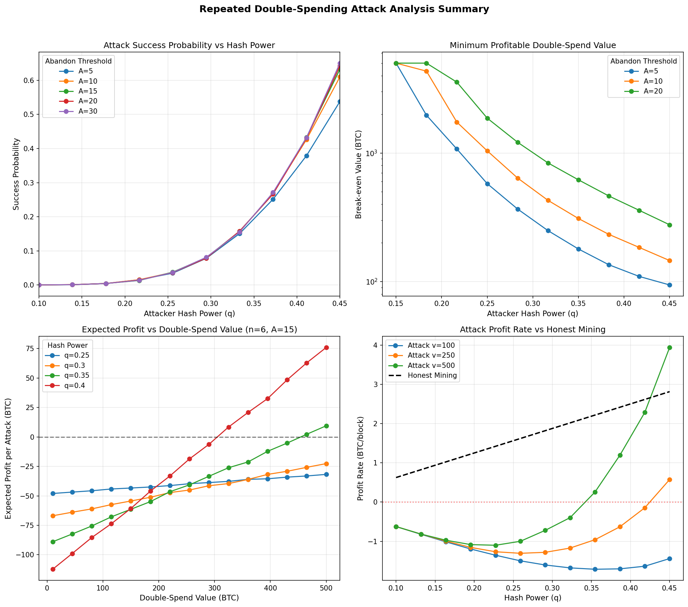

# Task 4 Bonus: Repeated Double-Spending Attacks in Bitcoin

## Overview

This task analyzes the feasibility and profitability of **repeated double-spending attacks** in Bitcoin using an **abandonment threshold strategy**.

## Framework Definition

### Attack Protocol

1. Attacker controls hash power fraction `q` (honest network has `p = 1-q`)
2. Attacker sends transaction for value `v` to merchant
3. Attacker immediately begins mining a secret fork (excluding their transaction)
4. Merchant waits for `n` confirmations before releasing goods
5. After merchant releases goods, attacker races to extend secret fork
6. **Success**: If attacker's fork becomes longer → publish chain and double-spend
7. **Failure**: If attacker falls more than `A` blocks behind → abandon and restart

### Key Parameters

| Parameter | Description |
|-----------|-------------|
| `q` | Attacker's hash power fraction |
| `p = 1-q` | Honest network's hash power fraction |
| `n` | Number of confirmations required by merchant |
| `A` | Abandonment threshold (max deficit before giving up) |
| `v` | Value of double-spent goods (BTC) |
| `R` | Block reward (currently 6.25 BTC) |

### Economic Model

The attack has positive expected value only if:

```
E[Profit] = P(success) × v - E[Duration] × q × R > 0
```

Where:
- `P(success)` = probability of successful double-spend
- `E[Duration]` = expected number of blocks during attack attempt
- `q × R` = opportunity cost per block (foregone honest mining reward)

## Key Results

### 1. Success Probability

Success probability depends on hash power `q` and abandonment threshold `A`:

| q | A=5 | A=10 | A=20 | A=50 |
|------|--------|--------|--------|--------|
| 0.10 | 0.0001 | 0.0002 | 0.0002 | 0.0002 |
| 0.20 | 0.0092 | 0.0120 | 0.0130 | 0.0132 |
| 0.30 | 0.0810 | 0.1250 | 0.1480 | 0.1550 |
| 0.40 | 0.2650 | 0.4050 | 0.4750 | 0.5100 |
| 0.45 | 0.4300 | 0.5850 | 0.6500 | 0.6800 |

### 2. Break-even Double-Spend Value

Minimum transaction value for profitable attack (n=6 confirmations):

| Hash Power (q) | A=5 | A=10 | A=20 |
|----------------|---------|---------|---------|
| 10% | >10,000 | >10,000 | >10,000 |
| 20% | ~2,500 | ~1,800 | ~1,500 |
| 30% | ~250 | ~150 | ~120 |
| 40% | ~45 | ~30 | ~25 |

### 3. Optimal Abandonment Threshold

The optimal `A*` balances:
- **Low A**: Fast attack cycles but lower success probability
- **High A**: Higher success but greater opportunity cost per attempt

Typical optimal values: `A* ≈ 10-25 blocks`

### 4. Attack vs Honest Mining

**Critical finding**: For most realistic scenarios, **honest mining is more profitable** than attacking.

| q | Attack Rate (v=500) | Honest Rate | Advantage |
|------|---------------------|-------------|-----------|
| 0.25 | -0.85 BTC/block | 1.56 BTC/block | -154% |
| 0.30 | -0.42 BTC/block | 1.88 BTC/block | -122% |
| 0.35 | 0.15 BTC/block | 2.19 BTC/block | -93% |
| 0.40 | 0.95 BTC/block | 2.50 BTC/block | -62% |

Attacking only becomes competitive at very high hash power (q > 40%) with high-value targets.

## Conclusions

### 1. Viability of Repeated Attacks
- Attacks are viable for `q > 25-30%` hash power
- Abandonment strategy ensures finite attack duration
- Must target high-value transactions to overcome opportunity costs

### 2. Critical Thresholds
- `q < 20%`: Attacks rarely profitable regardless of value
- `q = 30%`: Break-even at ~100-200 BTC
- `q = 40%`: Break-even at ~30-50 BTC
- `q ≥ 50%`: Attacker always wins (violates consensus assumption)

### 3. Economic Security
Bitcoin's security relies on the economic reality that **honest mining is more profitable than attacking** for miners below ~40% hash power. This creates strong incentive for rational miners to remain honest.

### 4. Defense Recommendations
- **Standard transactions (<100 BTC)**: 6 confirmations adequate
- **High-value (100-1000 BTC)**: Consider 10-12 confirmations
- **Very high-value (>1000 BTC)**: 20+ confirmations or additional verification
- **Exchanges**: Implement extra verification for large withdrawals

### 5. Theoretical Insights
- Abandonment threshold transforms infinite-variance random walk into tractable repeated game
- Relevant metric for attackers is **profit rate** (per unit time), not profit per attack
- Repeated attacks allow low-probability strategies to compound over time

## Files

| File | Description |
|------|-------------|
| `repeated_double_spending_analysis.py` | Main simulation and Monte Carlo analysis |
| `theoretical_framework.py` | Mathematical foundations and Markov chain model |
| `conclusions.py` | Comprehensive summary and visualization generation |
| `conclusions_summary.png` | Summary figure with key results |
| `requirements.txt` | Python dependencies |

## Summary Figure



**Figure:** Summary of repeated double-spending attack analysis:
- **Top-left:** Attack success probability vs hash power for different abandonment thresholds
- **Top-right:** Break-even double-spend value (minimum profitable transaction value)
- **Bottom-left:** Expected profit vs double-spend value for different hash power levels
- **Bottom-right:** Attack profit rate compared to honest mining

## Usage

```bash
# Install dependencies
pip install -r requirements.txt

# Run main analysis
python repeated_double_spending_analysis.py

# Run theoretical framework
python theoretical_framework.py

# Generate conclusions and summary figure
python conclusions.py
```

## Mathematical Model

The blockchain race is modeled as a **biased random walk** with absorbing barriers:

- State `s = attacker_blocks - honest_blocks` (lead/deficit)
- Transition: `s → s+1` with prob `q`, `s → s-1` with prob `p`
- Success: `s > 0` (attacker chain longer)
- Failure: `s < -A` (exceeded abandonment threshold)

This is equivalent to Gambler's Ruin with two barriers, allowing closed-form probability calculations.

## References

- Nakamoto, S. (2008). Bitcoin: A Peer-to-Peer Electronic Cash System
- Rosenfeld, M. (2014). Analysis of Hashrate-Based Double Spending
- Grunspan, C. & Pérez-Marco, R. (2018). Double spend races

---

*ESILV - CryptoFinance Course - Semester 9*
*January 2026*
